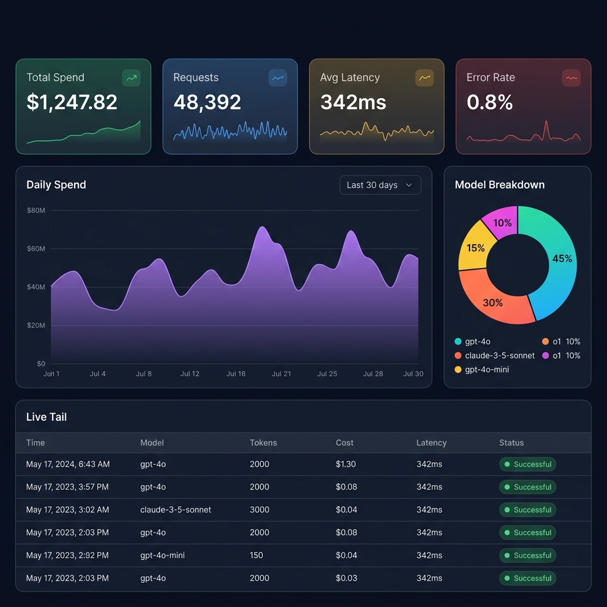

<p align="center">
  <picture>
    
  </picture>
</p>

<p align="center">
  <strong>Know what your AI spends, before it surprises you.</strong>
</p>

<p align="center">
  <a href="#-get-running-in-60-seconds"></a>
  &nbsp;
  <a href="https://github.com/NitheshK4/pace/issues"></a>
  &nbsp;
  <a href="#-api-cheatsheet"></a>
</p>

<br/>

<p align="center">
  
  
  
  
  
  
</p>

---

> **Pace** is a self-hosted observability platform that tracks every LLM API call your team makes — token usage, estimated cost, latency, errors, and rate limits — without ever storing a single prompt or completion. Deploy with one Docker command. Instrument with one line of Python. Sleep soundly knowing your AI budget is watched 24/7.

---

## 👀 Preview

<p align="center">
  <picture>
    
  </picture>
</p>

<p align="center"><em>Real-time spend tracking · Model breakdown · Live event tail · Budget alerts</em></p>

---

## 💡 Why Pace Exists

```
Monday:    "Why is our OpenAI bill $3,200 this month?"
Tuesday:   "Which service is burning through Claude tokens?"
Wednesday: "Did the rate limits spike again last night?"
Thursday:  "Are we going to blow our Q3 AI budget?"
Friday:    ✅ You deployed Pace on Monday. You already know all the answers.
```

<table>
<tr>
<td width="25%" align="center">
  <br/>
  <h3>💸</h3>
  <strong>Cost Visibility</strong>
  <br/><br/>
  Track spend per model, per project, per day. Auto-calculated from a versioned pricing registry.
  <br/><br/>
</td>
<td width="25%" align="center">
  <br/>
  <h3>⚡</h3>
  <strong>Live Monitoring</strong>
  <br/><br/>
  SSE-powered live tail. Watch every LLM call arrive in real-time. No polling.
  <br/><br/>
</td>
<td width="25%" align="center">
  <br/>
  <h3>🚨</h3>
  <strong>Smart Alerts</strong>
  <br/><br/>
  Budget thresholds with deduplication. Anomaly detection catches cost spikes at 3x baseline.
  <br/><br/>
</td>
<td width="25%" align="center">
  <br/>
  <h3>🔒</h3>
  <strong>Zero Trust</strong>
  <br/><br/>
  No prompts, no completions, no API keys ever stored. Ingestion keys are HMAC-SHA256 hashed.
  <br/><br/>
</td>
</tr>
</table>

---

## ▶️ Get Running in 60 Seconds

```bash
# 1. Clone
git clone https://github.com/NitheshK4/pace.git && cd pace

# 2. Launch (API + Web Console + PostgreSQL)
docker compose up --build -d

# 3. Open dashboard
open http://localhost:3000
```

**Demo credentials** (auto-seeded):
```
Email:    demo@pace.dev
Password: PaceDemo123!
```

| Endpoint | URL |
|:---|:---|
| 🖥️ Dashboard | [`localhost:3000`](http://localhost:3000) |
| ⚙️ API | [`localhost:8000/healthz`](http://localhost:8000/healthz) |
| 📈 Metrics | [`localhost:8000/metrics`](http://localhost:8000/metrics) |

---

## 🔌 Two Ways to Instrument

<table>
<tr>
<td width="50%" valign="top">

### Option 1 — Python SDK

**Best for**: Python apps using OpenAI / Anthropic SDKs

```bash
pip install pace-sdk
```

```python
from openai import OpenAI
from pace import track

client = track(
    OpenAI(),
    api_key="pace_YOUR_KEY",
    endpoint="http://localhost:8000"
)

# That's it. Every call is now tracked.
res = client.chat.completions.create(
    model="gpt-4o",
    messages=[{"role": "user", "content": "Hi!"}]
)
```

**Works with Anthropic too:**

```python
from anthropic import Anthropic
from pace import track

client = track(Anthropic(), api_key="pace_YOUR_KEY")
```

</td>
<td width="50%" valign="top">

### Option 2 — Local Proxy

**Best for**: Any language, zero code changes

```bash
pip install pace-proxy

PACE_API_KEY=pace_YOUR_KEY pace-proxy
# Proxy running on 127.0.0.1:8787
```

Point your app at the proxy instead of OpenAI:

```bash
# Before:
# https://api.openai.com/v1/chat/completions
#
# After:
curl http://127.0.0.1:8787/v1/chat/completions \
  -H "Authorization: Bearer sk-..." \
  -H "Content-Type: application/json" \
  -d '{"model":"gpt-4o","messages":[...]}'
```

The proxy forwards transparently, extracts usage telemetry from responses, and reports to Pace.

> 🔒 Binds to `127.0.0.1` only. Never exposed to network.

</td>
</tr>
</table>

---

## 🔬 What Gets Tracked

Every LLM call produces a telemetry event. Here's what Pace captures — and what it deliberately **does NOT**:

```diff
+ ✅ Captured                           - ❌ Never Stored
+ ─────────────────────────             - ─────────────────────────
+ Provider (openai, anthropic)          - Prompts / system messages
+ Model name (gpt-4o, claude-3, ...)   - Completions / responses
+ Input tokens                          - API keys (yours or provider's)
+ Output tokens                         - Authorization headers
+ Cached tokens                         - Request/response bodies
+ Reasoning tokens                      - User content of any kind
+ Latency (ms)
+ HTTP status code
+ Cost estimate (USD)
+ Sanitized metadata tags
+ Idempotent event ID
```

---

## 📊 Feature Tour

### 📉 Analytics Dashboard

| Metric | What You See |
|:---|:---|
| **Total Spend** | Cumulative USD with cost provenance (`known`, `unknown_model`, `supplied_by_client`) |
| **Token Mix** | Input + output + cached + reasoning breakdown |
| **Latency** | Average and estimated p95 across all calls |
| **Error Rate** | Percentage of 4xx/5xx responses |
| **Rate Limits** | Count of HTTP 429 responses from providers |
| **Timeseries** | Hourly or daily charts for spend, requests, tokens, errors |
| **Breakdown** | Per-model and per-provider spend attribution with percentages |

### 🔴 Live Tail

Real-time Server-Sent Events stream. Every ingested event is pushed to your browser instantly:

```
14:32:01.234  openai     gpt-4o               1,200 in · 400 out   $0.0140   342ms  ✅ 200
14:32:03.891  anthropic  claude-3-5-sonnet     2,100 in · 850 out   $0.0191   512ms  ✅ 200
14:32:04.102  openai     gpt-4o-mini             300 in · 120 out   $0.0001   189ms  ✅ 200
14:32:06.445  openai     gpt-4o               1,800 in · 600 out   $0.0105   298ms  🔴 429
```

### 🚨 Budget Alerts

Set spend caps per project. Pace evaluates every 60 seconds:

```yaml
budget:
  name: "Production Monthly Cap"
  limit: $500.00
  period: monthly          # daily | weekly | monthly | rolling_24h
  metric: spend            # spend | tokens | requests | error_rate
  thresholds: [50, 80, 100, 120]
  destinations:
    - type: console
    - type: webhook
      url: https://hooks.slack.com/...
  cool_down: 60min         # prevents alert spam
```

- ✅ **Deduplicated** — same threshold won't fire twice per period
- ✅ **Multi-destination** — console, webhook, Slack, email
- ✅ **Quiet hours** — suppress alerts during off-hours

### 🔮 Anomaly Detection

| Detection | Trigger | Severity |
|:---|:---|:---:|
| **Cost Spike** | Last hour's spend > **3× the 7-day hourly average** | 🔴 Critical |
| **Rate Limit Surge** | > **10 HTTP 429 errors** in the past hour | 🟡 Warning |

> Minimum sample safeguards (5+ recent, 20+ baseline events) prevent false positives.

### 💲 Pricing Registry

Pre-seeded with current rates for popular models:

| Provider | Models | Pricing |
|:---|:---|:---|
| **OpenAI** | `gpt-4o` · `gpt-4o-mini` · `o1` · `o3-mini` | Input + Output + Cached + Reasoning per 1K tokens |
| **Anthropic** | `claude-3-5-sonnet` · `claude-3-5-haiku` · `claude-3-opus` | Input + Output + Cached + Reasoning per 1K tokens |

- Auto-fallback for dated variants (`gpt-4o-2024-05-13` → `gpt-4o`)
- Unknown models → `cost_usd = NULL` (never guesses)
- Add custom rates via API or console

---

## 🔐 Privacy Architecture

```
YOUR APP                           PACE
  │                                  │
  │─── LLM call ──► Provider         │
  │◄── response ─── Provider         │
  │                                  │
  │─── telemetry ────────────────────►│
  │    (model, tokens, latency,      │
  │     status, sanitized metadata)  │
  │                                  │
  │    ❌ No prompts                  │
  │    ❌ No completions              │
  │    ❌ No API keys                 │
  │    ❌ No auth headers             │
  │    ❌ No request bodies           │
  │                                  │
```

| Mechanism | Detail |
|:---|:---|
| **Ingestion key hashing** | Keys stored as salted HMAC-SHA256 — raw key shown once, then discarded |
| **Metadata sanitization** | Denylist strips `prompt`, `completion`, `messages`, `content`, `authorization`, `api_key`, `secret`, `password` before storage |
| **Proxy loopback binding** | `127.0.0.1` only — never exposed to LAN/WAN |
| **Non-blocking telemetry** | Queue overflow → silent drop (your app is never affected) |
| **Audit trail** | Every admin action (budget create, key rotate, export, purge) is immutably logged |

---

## 🏗️ Architecture

```
                    ┌─────────────────────────────┐
                    │        YOUR APPS             │
                    │                              │
                    │  SDK: track(OpenAI())         │
                    │  Proxy: 127.0.0.1:8787        │
                    └──────────┬──────────────────-┘
                               │ telemetry
                               ▼
┌──────────────────────────────────────────────────────────────┐
│                                                              │
│   ┌──────────────┐    ┌──────────────┐    ┌──────────────┐  │
│   │  FastAPI API  │    │  Next.js 14  │    │ PostgreSQL   │  │
│   │  :8000        │    │  :3000       │    │ :5432        │  │
│   │               │    │              │    │              │  │
│   │  Ingest       │    │  Dashboard   │    │  8 tables    │  │
│   │  Analytics    │◄──►│  Live Tail   │    │  Indexed     │  │
│   │  Budgets      │    │  Budgets     │    │  NUMERIC     │  │
│   │  Exports      │    │  Settings    │    │  precision   │  │
│   │  Pricing      │    │              │    │              │  │
│   └──────────────┘    └──────────────┘    └──────────────┘  │
│                                                              │
│   ┌──────────────────────────────────────────────────────┐  │
│   │  Background Worker (60s cycle)                        │  │
│   │  • Budget threshold evaluation + deduplication        │  │
│   │  • Cost spike / rate-limit anomaly detection          │  │
│   │  • Data retention enforcement                         │  │
│   └──────────────────────────────────────────────────────┘  │
│                                                              │
│                         PACE CORE                            │
└──────────────────────────────────────────────────────────────┘
```

---

## 📂 Project Map

```
pace/
├── apps/
│   ├── api/                       # ⚙️  FastAPI backend
│   │   ├── app/api/v1/            #     Route handlers (9 modules)
│   │   ├── app/core/              #     Config, DB, security, logging
│   │   ├── app/models/            #     SQLAlchemy ORM (8 tables)
│   │   ├── app/schemas/           #     Pydantic schemas
│   │   ├── app/services/          #     Budget eval, anomaly detection
│   │   ├── app/worker/            #     Background scheduler
│   │   ├── alembic/               #     Database migrations
│   │   └── tests/                 #     Test suite
│   │
│   └── web/                       # 🖥️  Next.js 14 App Router
│       └── src/
│           ├── app/(auth)/        #     Login, register
│           ├── app/(dashboard)/   #     Dashboard, live-tail, budgets,
│           │                      #     explorer, pricing, quickstart, system
│           ├── components/        #     Navbar, Sidebar, Modals
│           └── lib/               #     API client
│
├── packages/
│   ├── python-sdk/                # 📦 pace-sdk
│   │   └── pace/
│   │       ├── client.py          #     track() — wraps OpenAI/Anthropic
│   │       ├── queue.py           #     Resilient batched telemetry queue
│   │       ├── privacy.py         #     Metadata sanitization
│   │       └── adapters/          #     Provider-specific extractors
│   │
│   └── proxy/                     # 🔀 pace-proxy
│       └── pace_proxy/server.py   #     Reverse proxy + allowlist
│
├── docker-compose.yml             # 🐳 One-command deploy
├── .env.example                   # 📋 Config reference
└── docs/                          # 📖 Demo scripts
```

---

## 📖 API Cheatsheet

<details>
<summary><strong>📥 Ingestion</strong></summary>

```bash
POST /v1/ingest/events
Authorization: Bearer pace_...

# Single event
{
  "event_id": "evt_001",
  "provider": "openai",
  "model": "gpt-4o",
  "input_tokens": 1200,
  "output_tokens": 400,
  "latency_ms": 350,
  "status_code": 200,
  "metadata": {"service": "chatbot"}
}

# Batch
{ "events": [ {...}, {...} ] }
```

Response:
```json
{
  "status": "accepted",
  "accepted_count": 1,
  "duplicate_count": 0,
  "rejected_count": 0
}
```

</details>

<details>
<summary><strong>📊 Analytics</strong></summary>

```bash
GET /v1/analytics/overview?project_id=...
GET /v1/analytics/timeseries?project_id=...&granularity=hour
GET /v1/analytics/breakdown?project_id=...
GET /v1/analytics/events?project_id=...&limit=50
GET /v1/analytics/live-tail?project_id=...          # SSE stream
```

</details>

<details>
<summary><strong>🔧 Management</strong></summary>

```bash
POST /v1/auth/register          GET  /v1/auth/me
POST /v1/auth/login

POST /v1/projects               GET  /v1/projects
POST /v1/projects/{id}/keys     GET  /v1/projects/{id}/keys

GET  /v1/pricing                POST /v1/pricing
GET  /v1/budgets                POST /v1/budgets
GET  /v1/budgets/alerts         DELETE /v1/budgets/{id}

GET  /v1/exports/csv?project_id=...
```

</details>

<details>
<summary><strong>🩺 System</strong></summary>

```bash
GET  /healthz                      # Health check
GET  /metrics                      # Prometheus
GET  /v1/system/diagnostics        # DB stats
POST /v1/system/retention/purge    # Cleanup
```

</details>

---

## ⚙️ Configuration

| Variable | Default | Notes |
|:---|:---|:---|
| `DATABASE_URL` | `postgresql+asyncpg://pace:pace@db:5432/pace` | Async connection |
| `SECRET_KEY` | *change in production!* | JWT signing (min 16 chars) |
| `INGESTION_KEY_SALT` | *change in production!* | HMAC salt (min 16 chars) |
| `CORS_ORIGINS` | `["http://localhost:3000"]` | Allowed origins |
| `DEMO_MODE` | `false` | Seed demo user |
| `DATA_RETENTION_DAYS` | `90` | Auto-purge threshold |
| `WORKER_ENABLED` | `true` | Background evaluator |

Full reference → [`.env.example`](.env.example)

---

## 📈 Database

**8 tables**, production-indexed:

```
users
  └─ projects
       ├── project_api_keys       (HMAC-SHA256)
       ├── usage_events           (idx: project+time, project+provider+model, project+status)
       ├── budgets                (multi-threshold, multi-metric, multi-period)
       ├── alert_deliveries       (deduplicated per threshold per period)
       └── audit_logs             (immutable trail)

pricing_rates                     (unique: provider+model+effective_from)
```

---

## 🤝 Contributing

```bash
# Fork → Clone → Branch → Commit → Push → PR
git checkout -b feature/your-feature
git commit -m "Add your feature"
git push origin feature/your-feature
```

All contributions welcome — features, docs, bug fixes, or ideas.

---

## 📄 License

MIT — see [LICENSE](LICENSE) for details.

---

<p align="center">
  <sub>Built with ☕ and a healthy fear of surprise LLM invoices.</sub>
</p>
