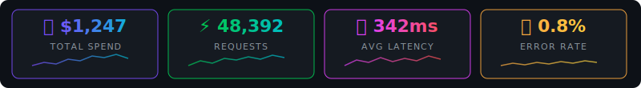

<!-- Animated Hero Banner -->
<p align="center">
  <a href="#-get-running-in-60-seconds">
    
  </a>
</p>

<p align="center">
  <strong>Know what your AI spends, before it surprises you.</strong><br/>
  <sub>Self-hosted LLM cost tracking · Real-time analytics · Budget alerts · Zero prompt storage</sub>
</p>

<p align="center">
  <a href="#-get-running-in-60-seconds"></a>
  &nbsp;
  <a href="#-api-cheatsheet"></a>
  &nbsp;
  <a href="https://github.com/NitheshK4/pace/issues"></a>
</p>

<p align="center">
  
  
  
  
  
  
</p>

---

<!-- Animated Metrics Dashboard -->
<p align="center">
  
</p>

---

## 💡 The Problem

```
Monday:    "Why is our OpenAI bill $3,200 this month?"
Tuesday:   "Which service is burning through Claude tokens?"
Wednesday: "Did rate limits spike again at 3 AM?"
Thursday:  "Are we going to blow our Q3 AI budget?"
Friday:    ✅ You deployed Pace on Monday. You already know all the answers.
```

> **Pace** is a self-hosted observability platform that tracks every LLM API call — token usage, estimated cost, latency, errors, and rate limits — without ever storing a single prompt or completion.

---

## ▶️ Get Running in 60 Seconds

```bash
git clone https://github.com/NitheshK4/pace.git && cd pace
docker compose up --build -d
open http://localhost:3000
```

**Demo credentials** (auto-seeded):
```
📧 demo@pace.dev    🔑 PaceDemo123!
```

| Endpoint | URL |
|:---|:---|
| 🖥️ Dashboard | [`localhost:3000`](http://localhost:3000) |
| ⚙️ API | [`localhost:8000/healthz`](http://localhost:8000/healthz) |
| 📈 Metrics | [`localhost:8000/metrics`](http://localhost:8000/metrics) |

---

## 🔌 Two Ways to Instrument

<table>
<tr>
<td width="50%" valign="top">

### Option 1 — Python SDK

```bash
pip install pace-sdk
```

```python
from openai import OpenAI
from pace import PaceClient

# Context manager with auto-flush on exit
with PaceClient(api_key="pace_YOUR_KEY", endpoint="http://localhost:8000") as pace:
    client = pace.track(OpenAI(), tags={"env": "prod"})
    res = client.chat.completions.create(
        model="gpt-4o",
        messages=[{"role": "user", "content": "Hi!"}]
    )
```

</td>
<td width="33%" valign="top">

### Option 2 — TypeScript SDK

```bash
npm install @pace/sdk
```

```typescript
import { PaceClient } from '@pace/sdk';

const pace = new PaceClient({
  apiKey: 'pace_YOUR_KEY',
  endpoint: 'http://localhost:8000'
});

// Non-blocking telemetry recording
pace.record({
  provider: 'openai',
  model: 'gpt-4o',
  input_tokens: 1200,
  output_tokens: 400,
  latency_ms: 350
});
```

</td>
<td width="33%" valign="top">

### Option 3 — Local Proxy (Zero Code)

```bash
pip install pace-proxy

PACE_API_KEY=pace_YOUR_KEY pace-proxy
# → Running on 127.0.0.1:8787
```

Point your app at the proxy:

```bash
curl http://127.0.0.1:8787/v1/chat/completions \
  -H "Authorization: Bearer sk-..." \
  -d '{"model":"gpt-4o","messages":[...]}'
```

Forwards transparently, extracts telemetry, reports to Pace.

> 🔒 Binds to `127.0.0.1` only.

</td>
</tr>
</table>

---

## 📊 What You See

<!-- Animated Spend Chart -->
<p align="center">
  
</p>

<table>
<tr>
<td width="25%" align="center"><h3>💰</h3><strong>Cost Tracking</strong><br/><sub>Per model, per project, per day. Auto-calculated from versioned pricing.</sub></td>
<td width="25%" align="center"><h3>📈</h3><strong>Timeseries</strong><br/><sub>Hourly & daily charts for spend, requests, tokens, errors.</sub></td>
<td width="25%" align="center"><h3>🍰</h3><strong>Breakdown</strong><br/><sub>Per-provider & per-model attribution with % share.</sub></td>
<td width="25%" align="center"><h3>📥</h3><strong>CSV Export</strong><br/><sub>One-click export with full audit trail.</sub></td>
</tr>
</table>

---

## 🔴 Live Tail

<!-- Animated Live Tail Feed -->
<p align="center">
  
</p>

SSE-powered real-time stream. Watch every LLM call arrive as it happens — no polling, no refresh. Notice the rate-limited call flash red.

---

## 🚨 Smart Alerts

```yaml
budget:
  name: "Production Monthly Cap"
  limit: $500.00
  period: monthly                # daily | weekly | monthly | rolling_24h
  metric: spend                  # spend | tokens | requests | error_rate
  thresholds: [50, 80, 100, 120]
  destinations:
    - console
    - webhook: https://hooks.slack.com/...
  cool_down: 60min
```

- **Deduplicated** — same threshold won't fire twice per period
- **Multi-destination** — console, webhook, Slack, email
- **Anomaly detection** — cost spikes > 3× baseline trigger 🔴 critical alerts
- **Rate limit surge** — >10 HTTP 429s in an hour trigger 🟡 warnings

---

## 🔬 What Gets Tracked (and What Doesn't)

```diff
+ ✅ CAPTURED                              - ❌ NEVER STORED
+ ──────────────────────────               - ──────────────────────────
+ Provider (openai, anthropic)             - Prompts / system messages
+ Model name                               - Completions / responses
+ Input / output / cached tokens           - API keys (yours or provider's)
+ Reasoning tokens                         - Authorization headers
+ Latency (ms)                             - Request or response bodies
+ HTTP status code                         - User content of any kind
+ Cost estimate (USD)
+ Sanitized metadata tags
```

**Privacy mechanisms**: HMAC-SHA256 key hashing · metadata denylist sanitization · loopback-only proxy · non-blocking telemetry (failures → silent drop, never crashes your app) · immutable audit logging

---

## 🏗️ Architecture

```
                     ┌───────────────────────────────┐
                     │         YOUR APPS              │
                     │  SDK: track(OpenAI())          │
                     │  Proxy: 127.0.0.1:8787         │
                     └──────────┬────────────────────-┘
                                │ telemetry
                                ▼
┌────────────────────────────────────────────────────────────────┐
│                         PACE CORE                              │
│                                                                │
│  ┌──────────────┐   ┌──────────────┐   ┌──────────────────┐  │
│  │  FastAPI API  │   │  Next.js 14  │   │  PostgreSQL 15   │  │
│  │  :8000        │   │  :3000       │   │  :5432           │  │
│  │               │   │              │   │                  │  │
│  │  Ingest       │   │  Dashboard   │   │  8 tables        │  │
│  │  Analytics    │◄─►│  Live Tail   │   │  NUMERIC costs   │  │
│  │  Budgets      │   │  Budgets     │   │  Composite idx   │  │
│  │  Exports      │   │  Settings    │   │                  │  │
│  └──────────────┘   └──────────────┘   └──────────────────┘  │
│                                                                │
│  ┌────────────────────────────────────────────────────────┐   │
│  │  Background Worker (60s)                                │   │
│  │  Budget evaluation · Anomaly detection · Retention      │   │
│  └────────────────────────────────────────────────────────┘   │
└────────────────────────────────────────────────────────────────┘
```

---

## 📂 Project Map

```
pace/
├── apps/
│   ├── api/                       # FastAPI backend
│   │   ├── app/api/v1/            #   9 route modules (ingest, analytics, budgets, ...)
│   │   ├── app/core/              #   Config, DB, security, logging
│   │   ├── app/models/            #   SQLAlchemy ORM (8 tables)
│   │   ├── app/services/          #   Budget eval, anomaly detection, alert delivery
│   │   ├── app/worker/            #   Background scheduler (60s cycle)
│   │   ├── alembic/               #   Migrations
│   │   └── tests/
│   │
│   └── web/                       # Next.js 14 (App Router)
│       └── src/app/(dashboard)/   #   Dashboard, live-tail, budgets, explorer, pricing
│
├── packages/
│   ├── python-sdk/                # pace-sdk: track(), flush(), ResilientTelemetryQueue
│   ├── typescript-sdk/            # @pace/sdk: PaceClient, ResilientTelemetryQueue (Node/TS)
│   └── proxy/                     # pace-proxy: reverse proxy + provider allowlist
│
├── docker-compose.yml             # One-command deploy
└── .env.example                   # Config reference
```

---

## 📖 API Cheatsheet

<details>
<summary><strong>📥 Ingestion</strong></summary>

```bash
POST /v1/ingest/events
Authorization: Bearer pace_...

{
  "event_id": "evt_001",
  "provider": "openai",
  "model": "gpt-4o",
  "input_tokens": 1200,
  "output_tokens": 400,
  "latency_ms": 350,
  "status_code": 200,
  "metadata": {"service": "chatbot"}
}

# Batch: { "events": [ {...}, {...} ] }
```
</details>

<details>
<summary><strong>📊 Analytics</strong></summary>

```bash
GET /v1/analytics/overview?project_id=...
GET /v1/analytics/timeseries?project_id=...&granularity=hour
GET /v1/analytics/breakdown?project_id=...
GET /v1/analytics/events?project_id=...&limit=50&min_latency_ms=500&errors_only=true
GET /v1/analytics/live-tail?project_id=...    # SSE stream
```
</details>

<details>
<summary><strong>🔧 Management</strong></summary>

```bash
POST /v1/auth/register     POST /v1/auth/login      GET /v1/auth/me
POST /v1/projects          GET  /v1/projects
POST /v1/projects/{id}/keys
GET  /v1/pricing           POST /v1/pricing
GET  /v1/budgets           POST /v1/budgets          DELETE /v1/budgets/{id}
GET  /v1/budgets/alerts
GET  /v1/exports/csv?project_id=...
```
</details>

<details>
<summary><strong>🩺 System</strong></summary>

```bash
GET  /healthz                       # Health check
GET  /metrics                       # Prometheus
GET  /v1/system/diagnostics         # DB stats
POST /v1/system/retention/purge     # Cleanup
```
</details>

---

## ⚙️ Configuration

| Variable | Default | Notes |
|:---|:---|:---|
| `DATABASE_URL` | `postgresql+asyncpg://pace:pace@db:5432/pace` | Async connection |
| `SECRET_KEY` | ⚠️ *change in prod* | JWT signing secret |
| `INGESTION_KEY_SALT` | ⚠️ *change in prod* | HMAC salt |
| `CORS_ORIGINS` | `["http://localhost:3000"]` | Allowed origins |
| `DEMO_MODE` | `false` | Seed demo user |
| `DATA_RETENTION_DAYS` | `90` | Auto-purge threshold |
| `WORKER_ENABLED` | `true` | Background evaluator |

Full reference → [`.env.example`](.env.example)

---

## 💲 Pricing Registry

Pre-seeded rates for cost estimation:

| Provider | Models |
|:---|:---|
| **OpenAI** | `gpt-4o` · `gpt-4o-mini` · `o1` · `o3-mini` |
| **Anthropic** | `claude-3-5-sonnet` · `claude-3-5-haiku` · `claude-3-opus` |

Supports input, output, cached, and reasoning token pricing. Auto-fallback for dated variants. Unknown models → `cost_usd = NULL` (never guesses). Add custom rates via API.

---

## 📈 Database

8 tables, production-indexed:

```
users → projects → usage_events        (idx: project+time, project+provider+model)
                 → project_api_keys     (HMAC-SHA256 hashed)
                 → budgets              (multi-threshold, multi-metric)
                 → alert_deliveries     (deduplicated per threshold per period)
                 → audit_logs           (immutable)
pricing_rates                           (versioned: provider+model+effective_from)
```

---

## 🤝 Contributing

```bash
git checkout -b feature/your-feature
git commit -m "Add your feature"
git push origin feature/your-feature
# Open a PR
```

---

## 📄 License

MIT — see [LICENSE](LICENSE) for details.

---

<p align="center">
  <sub>Built with ☕ and a healthy fear of surprise LLM invoices.</sub>
</p>
